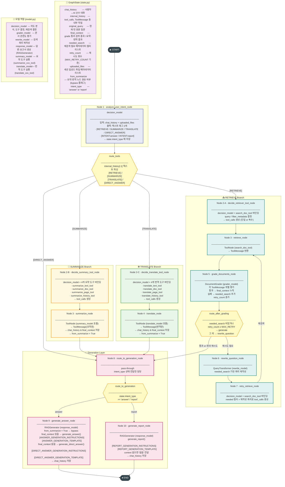

```mermaid
flowchart TB
    START([▶ START]) --> ANALYZE

    %% ============================================================
    %% Node 1: 사용자 의도 분석
    %% ============================================================
    subgraph N1["Node 1 · analyze_user_intent_node"]
        ANALYZE["decision_model
        ───────────────────────────────
        입력: chat_history + uploaded_files
        출력: 텍스트 태그 2개
        · [RETRIEVE / SUMMARIZE / TRANSLATE / DIRECT_ANSWER]
        · [INTENT:answer / INTENT:report]
        → state.intent_type 에 저장"]
    end

    ROUTE_TOOLS{{"route_tools
    ─────────────────
    internal_history[-1] 텍스트 파싱
    [RETRIEVE] / [SUMMARIZE]
    [TRANSLATE] / [DIRECT_ANSWER]"}}

    ANALYZE --> ROUTE_TOOLS

    %% ============================================================
    %% RETRIEVE 브랜치
    %% ============================================================
    subgraph RETRIEVE_BRANCH["📥 RETRIEVE Branch"]
        direction TB
        DEC_RET["Node 2-A · decide_retriever_tool_node
        ───────────────────────────────
        decision_model + search_doc_tool 바인딩
        query / filter_metadata 결정
        → tool_calls 생성 (단일 or 복수)"]

        RET_NODE["Node 3 · retrieve_node
        ───────────────────────────────
        ToolNode (search_doc_tool)
        → ToolMessage 반환"]

        GRADE["Node 5 · grade_documents_node
        ───────────────────────────────
        DocumentGrader (grader_model)
        각 ToolMessage 개별 평가
        통과 → final_context 누적
        실패 → needed_search 추가
        retry_count 증가"]

        ROUTE_GRADE{{"route_after_grading
        ─────────────────────
        needed_search 비었거나
        retry_count ≥ MAX_RETRY
        → generate
        그 외 → rewrite_question"}}

        REWRITE["Node 6 · rewrite_question_node
        ───────────────────────────────
        QueryTransformer (rewrite_model)
        needed_search 기반 쿼리 재작성"]

        RETRY_RET["Node 7 · retry_retrieve_node
        ───────────────────────────────
        decision_model + search_doc_tool 바인딩
        needed 필터 + 재작성 쿼리로 tool_calls 생성"]
    end

    %% ============================================================
    %% SUMMARIZE 브랜치
    %% ============================================================
    subgraph SUMMARIZE_BRANCH["📝 SUMMARIZE Branch"]
        direction TB
        DEC_SUM["Node 2-B · decide_summary_tool_node
        ───────────────────────────────
        decision_model + 4개 요약 도구 바인딩
        · summarize_text_tool
        · summarize_doc_tool
        · summarize_page_tool
        · summarize_history_tool
        → tool_calls 생성"]

        SUM_NODE["Node 3 · summarize_node
        ───────────────────────────────
        ToolNode (summary_model 호출)
        → ToolMessage(요약문)
        → chat_history & final_context 저장
        → from_summarize = True"]
    end

    %% ============================================================
    %% TRANSLATE 브랜치
    %% ============================================================
    subgraph TRANSLATE_BRANCH["🌐 TRANSLATE Branch"]
        direction TB
        DEC_TRANS["Node 2-C · decide_translate_tool_node
        ───────────────────────────────
        decision_model + 4개 번역 도구 바인딩
        · translate_text_tool
        · translate_doc_tool
        · translate_page_tool
        · translate_history_tool
        → tool_calls 생성"]

        TRANS_NODE["Node 4 · translate_node
        ───────────────────────────────
        ToolNode (translate_model 호출)
        → ToolMessage(번역문)
        → chat_history & final_context 저장
        → from_summarize = True"]
    end

    %% ============================================================
    %% Generation Layer
    %% ============================================================
    subgraph GENERATION["✨ Generation Layer"]
        direction TB
        ROUTE_GEN["Node 8 · route_to_generation_node
        ───────────────────────────────
        pass-through
        intent_type 상태 전달만 담당"]

        ROUTE_INTENT{{"route_to_generation
        ─────────────────────
        state.intent_type
        == 'answer' / 'report'"}}

        GEN_ANSWER["Node 9 · generate_answer_node
        ───────────────────────────────
        RAGGenerator (response_model)
        from_summarize = True → bypass
        final_context 있음 → generate_answer()
          [ANSWER_GENERATION_INSTRUCTIONS]
          [ANSWER_GENERATION_TEMPLATE]
        final_context 없음 → generate_direct_answer()
          [DIRECT_ANSWER_GENERATION_INSTRUCTIONS]
          [DIRECT_ANSWER_GENERATION_TEMPLATE]
        → chat_history 저장"]

        GEN_REPORT["Node 10 · generate_report_node
        ───────────────────────────────
        RAGGenerator (response_model)
        generate_report()
          [REPORT_GENERATION_INSTRUCTIONS]
          [REPORT_GENERATION_TEMPLATE]
        context 없으면 '없음' 전달
        → chat_history 저장"]
    end

    END_NODE([⏹ END])

    %% ============================================================
    %% 엣지 연결
    %% ============================================================

    %% route_tools → 브랜치 진입
    ROUTE_TOOLS -->|"[RETRIEVE]"| DEC_RET
    ROUTE_TOOLS -->|"[SUMMARIZE]"| DEC_SUM
    ROUTE_TOOLS -->|"[TRANSLATE]"| DEC_TRANS
    ROUTE_TOOLS -->|"[DIRECT_ANSWER]"| ROUTE_GEN

    %% RETRIEVE 내부 흐름
    DEC_RET --> RET_NODE
    RET_NODE --> GRADE
    GRADE --> ROUTE_GRADE
    ROUTE_GRADE -->|"통과 or 최대 재시도"| ROUTE_GEN
    ROUTE_GRADE -->|"재시도 필요"| REWRITE
    REWRITE --> RETRY_RET
    RETRY_RET -->|"재검색"| RET_NODE

    %% SUMMARIZE / TRANSLATE → Generation
    DEC_SUM  --> SUM_NODE
    DEC_TRANS --> TRANS_NODE
    SUM_NODE   --> ROUTE_GEN
    TRANS_NODE --> ROUTE_GEN

    %% Generation 분기
    ROUTE_GEN --> ROUTE_INTENT
    ROUTE_INTENT -->|"answer"| GEN_ANSWER
    ROUTE_INTENT -->|"report"| GEN_REPORT
    GEN_ANSWER --> END_NODE
    GEN_REPORT --> END_NODE

    %% ============================================================
    %% GraphState (참조)
    %% ============================================================
    subgraph STATE_BOX["💾 GraphState (state.py)"]
        STATE["chat_history         — 사용자↔AI 순수 대화
        internal_history    — tool_calls, ToolMessage 등 내부 작업
        original_query      — 현재 턴 원본 질문
        final_context       — grade 통과 검색 결과 / 요약·번역 결과
        needed_search       — 재검색 필요 메타데이터 필터 리스트
        retry_count         — 재시도 횟수 (MAX_RETRY_COUNT 기준)
        uploaded_files      — 세션 업로드 파일 메타데이터 리스트
        from_summarize      — 요약·번역 노드 경유 여부 (bypass 플래그)
        intent_type         — 'answer' or 'report'"]
    end

    %% ============================================================
    %% 모델 참조 (model.py)
    %% ============================================================
    subgraph MODEL_BOX["🤖 모델 역할 (model.py)"]
        MODELS["decision_model  — 의도 분석, 도구 결정, 재검색 결정
        grader_model   — 문서 관련도 평가
        rewrite_model  — 검색 쿼리 재작성
        response_model — 답변·보고서 생성 (RAGGenerator)
        summary_model  — 요약 도구 실행 (summarize_xxx_tool)
        translate_model— 번역 도구 실행 (translate_xxx_tool)"]
    end

    %% ============================================================
    %% 스타일
    %% ============================================================
    classDef node1     fill:#e8eaf6,stroke:#3f51b5,stroke-width:2px
    classDef retrieve  fill:#e0f2f1,stroke:#00796b,stroke-width:2px
    classDef summarize fill:#fff8e1,stroke:#ff8f00,stroke-width:2px
    classDef translate fill:#e8f5e9,stroke:#388e3c,stroke-width:2px
    classDef generation fill:#fce4ec,stroke:#c2185b,stroke-width:2px
    classDef router    fill:#fff9c4,stroke:#f9a825,stroke-width:2px
    classDef state     fill:#f3e5f5,stroke:#7b1fa2,stroke-width:1px
    classDef endpoint  fill:#37474f,stroke:#263238,color:#fff,stroke-width:2px

    class ANALYZE node1
    class DEC_RET,RET_NODE,GRADE,REWRITE,RETRY_RET retrieve
    class DEC_SUM,SUM_NODE summarize
    class DEC_TRANS,TRANS_NODE translate
    class ROUTE_GEN,GEN_ANSWER,GEN_REPORT generation
    class ROUTE_TOOLS,ROUTE_GRADE,ROUTE_INTENT router
    class STATE,MODELS state
    class START,END_NODE endpoint
```
