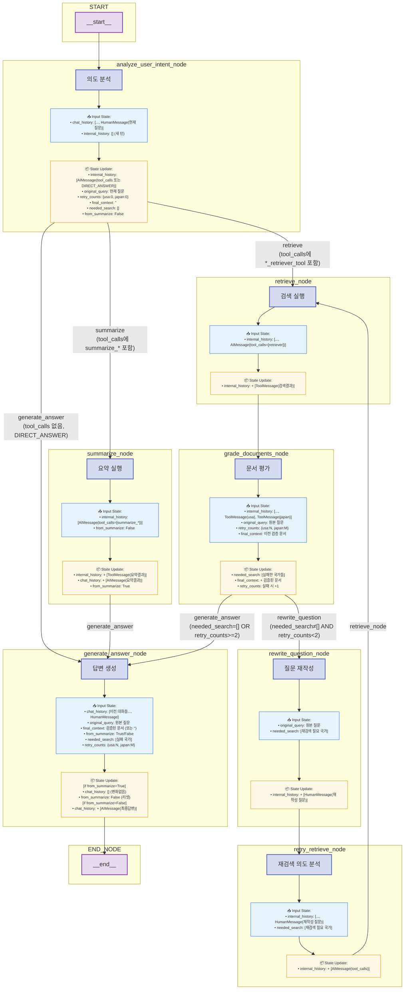

```mermaid
flowchart TD
    subgraph START
        S[__start__]
    end

    subgraph ANALYZE[analyze_user_intent_node]
        A[의도 분석]
        A_INPUT["📥 Input State:
        • chat_history: [..., HumanMessage(현재질문)]
        • internal_history: [] (새 턴)"]
        A_STATE["📦 State Update:
        • internal_history: [AIMessage(tool_calls 또는 DIRECT_ANSWER)]
        • original_query: 현재 질문
        • retry_counts: {usa:0, japan:0}
        • final_context: ''
        • needed_search: []
        • from_summarize: False"]
    end

    subgraph SUMMARIZE[summarize_node]
        SUM[요약 실행]
        SUM_INPUT["📥 Input State:
        • internal_history: [AIMessage(tool_calls=[summarize_*])]
        • from_summarize: False"]
        SUM_STATE["📦 State Update:
        • internal_history: + [ToolMessage(요약결과)]
        • chat_history: + [AIMessage(요약결과)]
        • from_summarize: True"]
    end

    subgraph RETRIEVE[retrieve_node]
        R[검색 실행]
        R_INPUT["📥 Input State:
        • internal_history: [..., AIMessage(tool_calls=[retriever])]"]
        R_STATE["📦 State Update:
        • internal_history: + [ToolMessage(검색결과)]"]
    end

    subgraph GRADE[grade_documents_node]
        G[문서 평가]
        G_INPUT["📥 Input State:
        • internal_history: [..., ToolMessage(usa), ToolMessage(japan)]
        • original_query: 원본 질문
        • retry_counts: {usa:N, japan:M}
        • final_context: 이전 검증 문서"]
        G_STATE["📦 State Update:
        • needed_search: [실패한 국가들]
        • final_context: + 검증된 문서
        • retry_counts: 실패 시 +1"]
    end

    subgraph REWRITE[rewrite_question_node]
        RW[질문 재작성]
        RW_INPUT["📥 Input State:
        • original_query: 원본 질문
        • needed_search: [재검색 필요 국가]"]
        RW_STATE["📦 State Update:
        • internal_history: + [HumanMessage(재작성 질문)]"]
    end

    subgraph RETRY[retry_retrieve_node]
        RT[재검색 의도 분석]
        RT_INPUT["📥 Input State:
        • internal_history: [..., HumanMessage(재작성 질문)]
        • needed_search: [재검색 필요 국가]"]
        RT_STATE["📦 State Update:
        • internal_history: + [AIMessage(tool_calls)]"]
    end

    subgraph GENERATE[generate_answer_node]
        GEN[답변 생성]
        GEN_INPUT["📥 Input State:
        • chat_history: [이전 대화들..., HumanMessage]
        • original_query: 원본 질문
        • final_context: 검증된 문서 (또는 '')
        • from_summarize: True/False
        • needed_search: [실패 국가]
        • retry_counts: {usa:N, japan:M}"]
        GEN_STATE["📦 State Update:
        [if from_summarize=True]
        • chat_history: [] (변화없음)
        • from_summarize: False (리셋)
        [if from_summarize=False]
        • chat_history: + [AIMessage(최종답변)]"]
    end

    subgraph END_NODE
        E[__end__]
    end

    %% Edges
    S --> A
    A --> A_INPUT
    A_INPUT --> A_STATE
    
    A_STATE -->|"summarize
    (tool_calls에 summarize_* 포함)"| SUM
    A_STATE -->|"retrieve
    (tool_calls에 *_retriever_tool 포함)"| R
    A_STATE -->|"generate_answer
    (tool_calls 없음, DIRECT_ANSWER)"| GEN
    
    SUM --> SUM_INPUT
    SUM_INPUT --> SUM_STATE
    SUM_STATE -->|"generate_answer"| GEN
    
    R --> R_INPUT
    R_INPUT --> R_STATE
    R_STATE --> G
    
    G --> G_INPUT
    G_INPUT --> G_STATE
    
    G_STATE -->|"generate_answer
    (needed_search=[] OR retry_counts>=2)"| GEN
    G_STATE -->|"rewrite_question
    (needed_search≠[] AND retry_counts<2)"| RW
    
    RW --> RW_INPUT
    RW_INPUT --> RW_STATE
    RW_STATE --> RT
    
    RT --> RT_INPUT
    RT_INPUT --> RT_STATE
    RT_STATE -->|"retrieve_node"| R
    
    GEN --> GEN_INPUT
    GEN_INPUT --> GEN_STATE
    GEN_STATE --> E

    %% Styling
    classDef startEnd fill:#e8daef,stroke:#8e44ad,stroke-width:2px
    classDef process fill:#d5dbf0,stroke:#5b6abf,stroke-width:2px
    classDef inputState fill:#e8f4fd,stroke:#3b82f6,stroke-width:1px,font-size:10px
    classDef outputState fill:#fef9e7,stroke:#f39c12,stroke-width:1px,font-size:10px
    
    class S,E startEnd
    class A,SUM,R,G,RW,RT,GEN process
    class A_INPUT,SUM_INPUT,R_INPUT,G_INPUT,RW_INPUT,RT_INPUT,GEN_INPUT inputState
    class A_STATE,SUM_STATE,R_STATE,G_STATE,RW_STATE,RT_STATE,GEN_STATE outputState
```