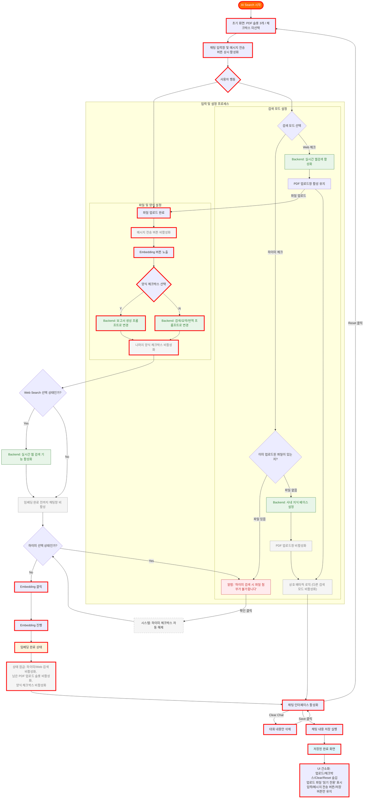

```mermaid
graph TD
    %% 1. 시작 및 초기 상태
    Start([AI Search 시작]) --> Initial["초기 화면: PDF 슬롯 3개 / 체크박스 미선택"]
    Initial --> Default_Active["채팅 입력창 및 메시지 전송 버튼 상시 활성화"]
    Default_Active --> Action{사용자 행동}

    %% 공간 최적화를 위한 서브그래프 (나란히 배치)
    subgraph "입력 및 설정 프로세스"
        direction LR
        subgraph "파일 및 양식 설정"
            direction TD
            PDF_Uploaded["파일 업로드 완료"] --> Msg_Btn_Off["메시지 전송 버튼 비활성화"]
            Msg_Btn_Off --> Embed_Btn_On["Embedding 버튼 노출"]
            Embed_Btn_On --> Form_Select{"양식 체크박스 선택"}
            Form_Select -- "Y" --> Form_Report_BE["Backend: 보고서 생성 프롬프트로 변경"]
            Form_Select -- "N" --> Form_General_BE["Backend: 검색/요약/번역 프롬프트로 변경"]
            Form_Report_BE & Form_General_BE --> Exclusive_Form["나머지 양식 체크박스 비활성화"]
        end

        subgraph "검색 모드 설정"
            direction TD
            Mode_Decision{"검색 모드 선택"}
            Mode_Decision -- "하이미 체크" --> HiMe_Check{"이미 업로드된 파일이 있는지?"}
            HiMe_Check -- "파일 있음" --> Common_Alert["알람: '하이미 검색 시 파일 첨부가 불가합니다'"]
            HiMe_Check -- "파일 없음" --> HiMe_Backend["Backend: 사내 지식 베이스 설정"]
            HiMe_Backend --> HiMe_UI["PDF 업로드창 비활성화"]
            
            Mode_Decision -- "Web 체크" --> Web_Backend["Backend: 실시간 웹검색 활성화"]
            Web_Backend --> Web_UI["PDF 업로드창 활성 유지"]
            Web_UI -- "파일 업로드" --> PDF_Uploaded
            
            HiMe_UI & Web_UI --> Mode_Fixed["상호 배타적 로직 (다른 검색 모드 비활성화)"]
        end
    end

    %% 사용자 행동에서 각 프로세스로 연결
    Action --> PDF_Uploaded
    Action --> Mode_Decision

    %% 알람 후속 로직
    Common_Alert -- "확인 클릭" --> Auto_Uncheck["시스템: 하이미 체크박스 자동 해제"]
    Auto_Uncheck --> HiMe_Final_Check{"하이미 선택 상태인가?"}

    %% 5. 임베딩 및 채팅 활성화
    Exclusive_Form --> Embed_Check{"Web Search 선택 상태인가?"}
    Embed_Check -- "Yes" --> Web_Activation["Backend: 실시간 웹 검색 기능 활성화"]
    Web_Activation --> Embed_Required["임베딩 완료 전까지 채팅창 비활성"]
    Embed_Check -- "No" --> Embed_Required
    
    Embed_Required --> HiMe_Final_Check
    HiMe_Final_Check -- "Yes" --> Common_Alert
    HiMe_Final_Check -- "No" --> Embed_Click["Embedding 클릭"]
    
    Embed_Click --> Embedding_Process["Embedding 진행"] --> Post_Embedding["임베딩 완료 상태"]
    Post_Embedding --> Lock_UI["상태 잠금: 하이미/Web 검색 비활성화, <br/>남은 PDF 업로드 슬롯 비활성화, <br/>양식 체크박스 비활성화"]
    
    %% 6. 채팅 및 완료
    Mode_Fixed --> Chat_Loop["채팅 인터페이스 활성화"]
    Lock_UI --> Chat_Loop
    
    Chat_Loop -- "Clear Chat" --> Chat_Clear["대화 내용만 삭제"]
    Chat_Clear --> Chat_Loop
    Chat_Loop -- "Reset 클릭" --> Initial
    
    Chat_Loop -- "Save 클릭" --> Saved_Action["채팅 내용 저장 실행"]
    Saved_Action --> Saved_State["저장된 완료 화면"]
    Saved_State --> UI_Final["UI 간소화: <br/>업로드/체크박스/Clear/Reset 숨김<br/>업로드 파일 '읽기 전용' 표시<br/>입력/메시지 전송 버튼/저장 버튼만 유지"]

    %% --- 스타일 가이드 (빨간색 하이라이트 및 회색 비활성화) ---
    %% 구간 1 하이라이트
    style Start fill:#FF6B00,color:#fff,stroke:#ff0000,stroke-width:4px
    style Initial stroke:#ff0000,stroke-width:4px
    style Default_Active stroke:#ff0000,stroke-width:4px
    style Action stroke:#ff0000,stroke-width:4px
    style PDF_Uploaded stroke:#ff0000,stroke-width:4px
    style Msg_Btn_Off fill:#f5f5f5,stroke:#ff0000,stroke-width:4px,color:#757575
    style Embed_Btn_On stroke:#ff0000,stroke-width:4px
    style Form_Select stroke:#ff0000,stroke-width:4px
    style Form_Report_BE fill:#e8f5e9,stroke:#ff0000,stroke-width:4px,color:#2e7d32
    style Form_General_BE fill:#e8f5e9,stroke:#ff0000,stroke-width:4px,color:#2e7d32
    style Exclusive_Form fill:#f5f5f5,stroke:#ff0000,stroke-width:4px,color:#757575

    %% 구간 2 하이라이트
    style Embed_Click stroke:#ff0000,stroke-width:4px
    style Embedding_Process stroke:#ff0000,stroke-width:4px
    style Post_Embedding fill:#fff4dd,stroke:#ff0000,stroke-width:4px
    style Lock_UI fill:#f5f5f5,stroke:#ff0000,stroke-width:4px,color:#757575
    style Chat_Loop stroke:#ff0000,stroke-width:4px
    style Chat_Clear stroke:#ff0000,stroke-width:4px
    style Saved_Action stroke:#ff0000,stroke-width:4px
    style Saved_State fill:#e1f5fe,stroke:#ff0000,stroke-width:4px
    style UI_Final stroke:#ff0000,stroke-width:4px

    %% 일반 스타일 (녹색 백엔드 및 회색 비활성화)
    style HiMe_Backend fill:#e8f5e9,stroke:#2e7d32,color:#2e7d32
    style Web_Backend fill:#e8f5e9,stroke:#2e7d32,color:#2e7d32
    style Web_Activation fill:#e8f5e9,stroke:#2e7d32,color:#2e7d32
    style HiMe_UI fill:#f5f5f5,stroke:#9e9e9e,color:#757575
    style Mode_Fixed fill:#f5f5f5,stroke:#9e9e9e,color:#757575
    style Embed_Required fill:#f5f5f5,stroke:#9e9e9e,color:#757575
    style Common_Alert fill:#ffebee,stroke:#c62828,color:#c62828
    style Auto_Uncheck fill:#f5f5f5,stroke:#9e9e9e,stroke-dasharray: 5 5
```