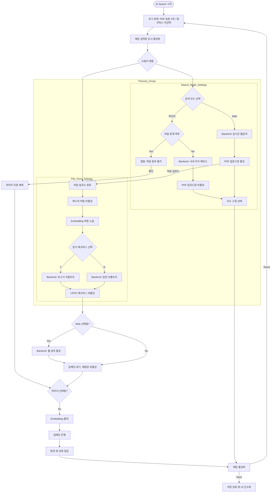

```mermaid
graph TD
    %% 1. 시작
    Start([AI Search 시작]) --> Initial["초기 화면: PDF 슬롯 3개 / 체크박스 미선택"]
    Initial --> Default_Active["채팅 입력창 상시 활성화"]
    Default_Active --> Action{사용자 행동}

    %% 2. 서브그래프 설정 (구조적 안정성 확보)
    subgraph "Process_Group"
        direction LR
        subgraph "File_Form_Settings"
            direction TD
            PDF_Uploaded["파일 업로드 완료"] --> Msg_Btn_Off["메시지 버튼 비활성"]
            Msg_Btn_Off --> Embed_Btn_On["Embedding 버튼 노출"]
            Embed_Btn_On --> Form_Select{"양식 체크박스 선택"}
            Form_Select -- "Y" --> Form_Report_BE["Backend: 보고서 프롬프트"]
            Form_Select -- "N" --> Form_General_BE["Backend: 일반 프롬프트"]
            Form_Report_BE & Form_General_BE --> Exclusive_Form["나머지 체크박스 비활성"]
        end

        subgraph "Search_Mode_Settings"
            direction TD
            Mode_Decision{"검색 모드 선택"}
            Mode_Decision -- "하이미" --> HiMe_Check{"파일 존재 여부"}
            HiMe_Check -- "Yes" --> Common_Alert["알람: 파일 첨부 불가"]
            HiMe_Check -- "No" --> HiMe_BE["Backend: 사내 지식 베이스"]
            HiMe_BE --> HiMe_UI["PDF 업로드창 비활성"]
            
            Mode_Decision -- "Web" --> Web_BE["Backend: 실시간 웹검색"]
            Web_BE --> Web_UI["PDF 업로드창 활성"]
            Web_UI -- "파일 업로드" --> PDF_Uploaded
            
            HiMe_UI & Web_UI --> Mode_Fixed["모드 고정 상태"]
        end
    end

    %% 3. 연결 및 마무리 로직
    Action --> PDF_Uploaded
    Action --> Mode_Decision

    Common_Alert -- "확인" --> Auto_Uncheck["하이미 자동 해제"]
    Auto_Uncheck --> HiMe_Final_Check{"하이미 선택중?"}

    Exclusive_Form --> Embed_Check{"Web 선택중?"}
    Embed_Check -- "Yes" --> Web_Activation["Backend: 웹 검색 활성"]
    Web_Activation --> Embed_Required["임베딩 대기: 채팅창 비활성"]
    Embed_Check -- "No" --> Embed_Required
    
    Embed_Required --> HiMe_Final_Check
    HiMe_Final_Check -- "No" --> Embed_Click["Embedding 클릭"]
    
    Embed_Click --> Embedding_Process["임베딩 진행"] --> Post_Embedding["완료 및 상태 잠금"]
    Post_Embedding --> Chat_Loop["채팅 활성화"]
    Mode_Fixed --> Chat_Loop
    
    Chat_Loop -- "Reset" --> Initial
    Chat_Loop -- "Save" --> Saved_State["저장 완료 및 UI 간소화"]
```